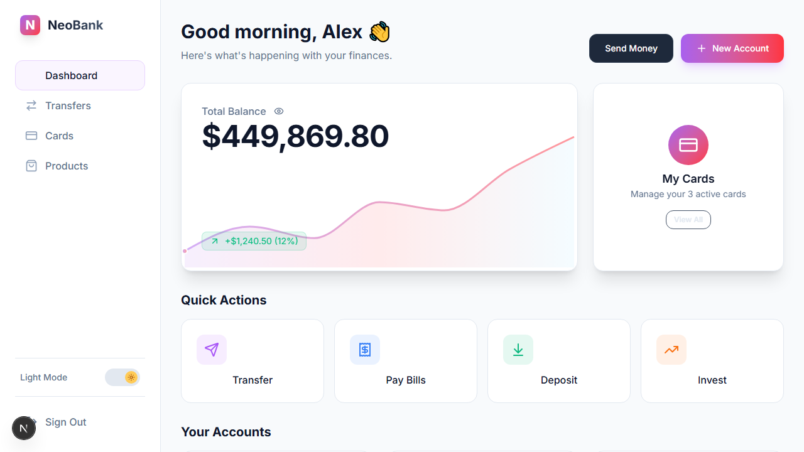
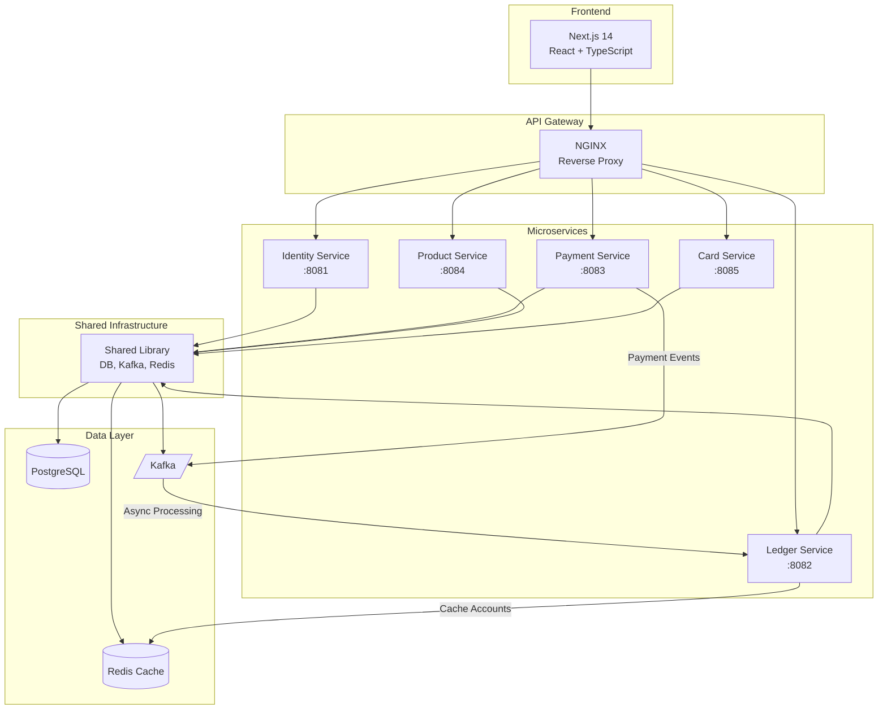
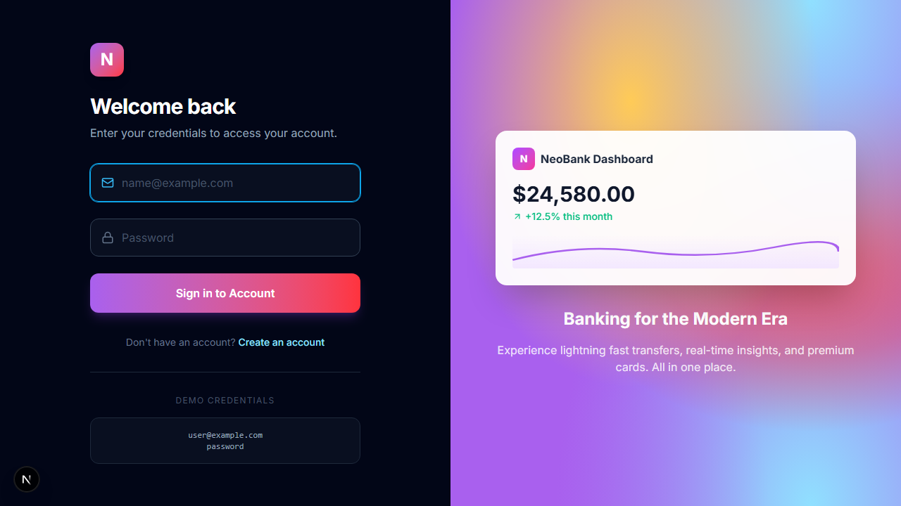
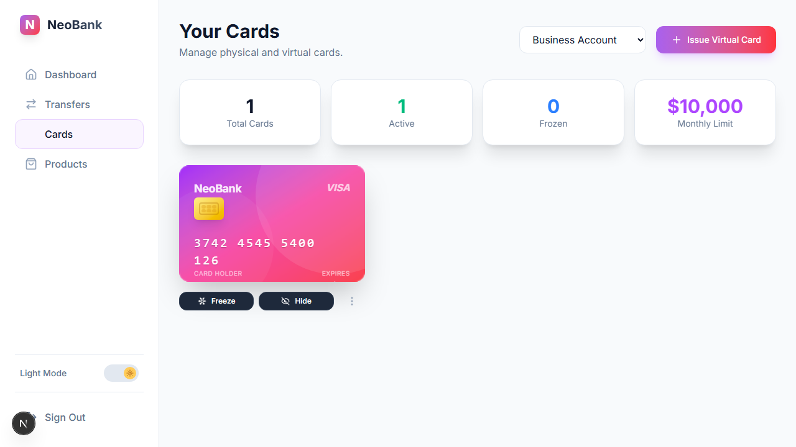
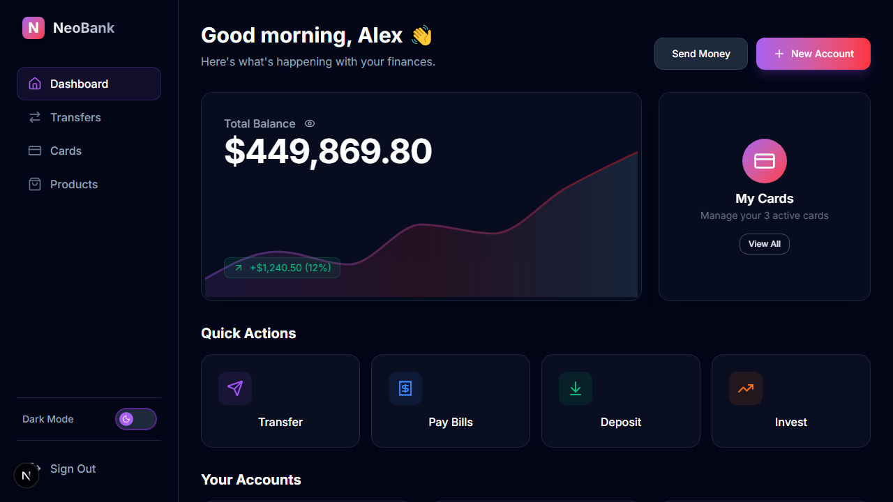
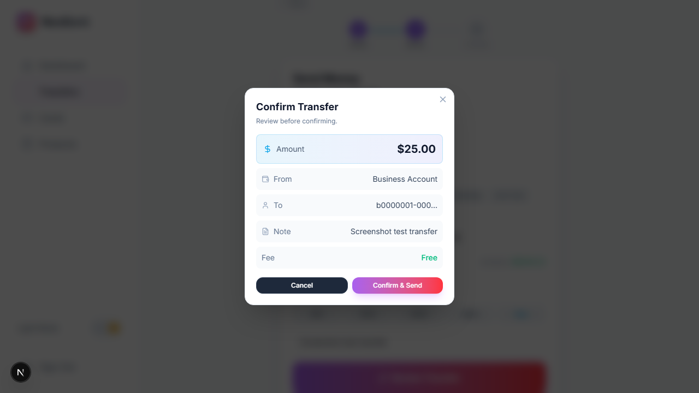

# NeoBank - Modern Digital Banking Platform

<div align="center">



A full-stack digital banking platform built with **Go microservices** and **Next.js**, demonstrating enterprise-grade software engineering practices.

[Features](#features) • [Architecture](#architecture) • [Tech Stack](#tech-stack) • [Demo](#demo) • [Getting Started](#getting-started)

</div>

---

## 🎯 Overview

NeoBank is a comprehensive fintech application showcasing modern software development competencies including microservices architecture, async event processing, caching strategies, responsive UI design, and end-to-end testing.

## ✨ Features

### Banking Operations
- **Account Management** - Create and manage multiple account types (Checking, Savings, Investment)
- **Money Transfers** - Secure fund transfers with step-by-step wizard, preset amounts, and instant confirmation
- **Virtual Cards** - Issue, freeze/unfreeze, and manage virtual debit cards
- **Financial Products** - Browse and compare banking products with category filters

### User Experience
- **Responsive Design** - Optimized for desktop and mobile with bottom navigation
- **Dark/Light Mode** - Full theme support with smooth transitions
- **Real-time Feedback** - Animated interactions, success confetti, and loading states
- **Progressive Disclosure** - Clear multi-step flows (Details → Review → Complete)

---

## 🏗️ Architecture



### Service Responsibilities

| Service | Port | Responsibility |
|---------|------|----------------|
| **Identity** | 8081 | JWT authentication, user registration, bcrypt password hashing |
| **Ledger** | 8082 | Account management, balance tracking, transaction history |
| **Payment** | 8083 | Transfer orchestration, Kafka event publishing |
| **Product** | 8084 | Banking products catalog, interest rates |
| **Card** | 8085 | Virtual card issuance, card lifecycle management |

---

## 🛠️ Tech Stack

### Backend
| Technology | Purpose |
|------------|---------|
| **Go 1.21+** | Microservices runtime |
| **Gin** | HTTP web framework |
| **GORM** | ORM for PostgreSQL |
| **JWT** | Stateless authentication |
| **Kafka** | Async event streaming |
| **Redis** | Distributed caching |
| **PostgreSQL** | Primary data store |

### Frontend
| Technology | Purpose |
|------------|---------|
| **Next.js 14** | React framework with App Router |
| **TypeScript** | Type-safe JavaScript |
| **Tailwind CSS** | Utility-first styling |
| **Framer Motion** | Animations & transitions |
| **Recharts** | Data visualization |
| **Playwright** | E2E browser testing |

---

## 🎥 Demo

### Video Walkthrough

<p align="center">
  
</p>


*The video demonstrates: Landing Page → Login → Dashboard → Transfers → Cards → Products → Theme Toggle*

### Application Flow

| 1. Landing Page | 2. Sign In | 3. Dashboard |
|-----------------|------------|--------------|
|  |  |  |

| 4. Transfers | 5. Cards | 6. Products |
|--------------|----------|-------------|
|  |  |  |

| 7. Dark Mode | 8. Light Mode |
|--------------|---------------|
|  |  |


<details>
<summary><b>📱 Landing & Authentication</b></summary>

| Landing Page | Login |
|--------------|-------|
|  |  |

</details>

<details>
<summary><b>📊 Dashboard</b></summary>

| Dark Mode | Light Mode |
|-----------|------------|
|  |  |

**Features visible:**
- Personalized greeting with time-based message
- Total balance with interactive chart
- Quick action buttons (Transfer, Pay Bills, Deposit, Invest)
- Account cards with color-coded types
- Balance hide/show toggle

</details>

<details>
<summary><b>💸 Transfers</b></summary>

| Transfer Form | Confirmation Modal |
|---------------|-------------------|
|  |  |

**Features:**
- 3-step progress indicator
- Quick account selection
- Preset amount buttons ($50-$500 + Max)
- Available balance display
- Confirmation modal with icons
- Confetti success animation

</details>

<details>
<summary><b>💳 Cards</b></summary>


**Features:**
- Photo-realistic 3D card designs
- Dynamic gradient themes
- Freeze/unfreeze toggle
- Hide/show card number
- Card statistics dashboard

</details>

<details>
<summary><b>📦 Products</b></summary>


**Features:**
- Category filter tabs
- Product type icons
- Comparison selection (up to 3)
- Interest rate display

</details>

---

## 🎓 Competencies Demonstrated

### Software Architecture
- ✅ **Microservices Pattern** - 5 independently deployable services with clear boundaries
- ✅ **Shared Library** - Common utilities (DB, Kafka, Redis) extracted for reuse
- ✅ **Event-Driven Architecture** - Kafka for async payment processing
- ✅ **Caching Strategy** - Redis for account balance caching with invalidation
- ✅ **Repository Pattern** - Clean separation between data and business logic

### Backend Engineering
- ✅ **RESTful API Design** - Resource-oriented endpoints with proper HTTP methods
- ✅ **JWT Authentication** - Stateless auth with middleware protection
- ✅ **Password Security** - bcrypt hashing with proper salt rounds
- ✅ **Database Transactions** - GORM transaction support for consistency
- ✅ **Error Handling** - Structured error responses and logging
- ✅ **Graceful Shutdown** - Signal handling for clean service termination

### Frontend Engineering
- ✅ **Component Architecture** - Reusable UI components (Card, Button, Input)
- ✅ **State Management** - React hooks with proper lifting and context
- ✅ **Responsive Design** - Mobile-first with adaptive layouts
- ✅ **Theme System** - Dark/light mode with CSS variables
- ✅ **Form Validation** - Client-side validation with real-time feedback
- ✅ **Animation** - Framer Motion for micro-interactions

### DevOps & Quality
- ✅ **Containerization** - Docker configurations for all services
- ✅ **Infrastructure as Code** - Docker Compose for local development
- ✅ **E2E Testing** - Playwright test suite with 18+ automated tests
- ✅ **Visual Documentation** - Automated screenshot generation

---

## 🚀 Getting Started

### Prerequisites
- Go 1.21+
- Node.js 18+
- Docker & Docker Compose
- PostgreSQL 14+ (or use Docker)

### Quick Start

1. **Clone the repository**
```bash
git clone https://github.com/yourusername/neobank.git
cd neobank
```

2. **Start infrastructure**
```bash
cd infra
docker-compose up -d postgres redis kafka
```

3. **Run backend services**
```bash
cd backend
# In separate terminals:
go run ./identity-service/cmd/main.go
go run ./ledger-service/cmd/main.go
go run ./payment-service/cmd/main.go
go run ./product-service/cmd/main.go
go run ./card-service/cmd/main.go
```

4. **Run frontend**
```bash
cd frontend
npm install
npm run dev
```

5. **Open the app**
Navigate to [http://localhost:3000](http://localhost:3000)

**Demo credentials:**
- Email: `demo@neobank.com`
- Password: `password`

### Running Tests

```bash
cd frontend
npx playwright test
```

---

## 📁 Project Structure

```
neobank/
├── backend/
│   ├── identity-service/    # Auth & user management
│   ├── ledger-service/      # Accounts & transactions  
│   ├── payment-service/     # Transfer orchestration
│   ├── product-service/     # Product catalog
│   ├── card-service/        # Virtual cards
│   └── shared-lib/          # Common utilities
│       ├── pkg/db/          # PostgreSQL connection
│       ├── pkg/kafka/       # Event producer/consumer
│       └── pkg/cache/       # Redis client
├── frontend/
│   ├── app/
│   │   ├── components/      # Reusable UI components
│   │   ├── context/         # React context providers
│   │   ├── dashboard/       # Dashboard page
│   │   ├── transfers/       # Transfer flow
│   │   ├── cards/           # Card management
│   │   └── products/        # Product catalog
│   └── e2e/                 # Playwright tests
├── infra/
│   ├── docker-compose.yml   # Infrastructure stack
│   └── seed.sql             # Database seed data
└── screenshots/             # Visual documentation
```

---

## 📄 License

This project is for demonstration purposes. All rights reserved.

---

<div align="center">

**Built with ❤️ to demonstrate modern full-stack engineering**

</div>
