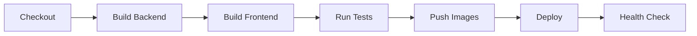

# NeoBank Jenkins Configuration

## Jenkinsfile

The main `Jenkinsfile` in the project root provides a complete CI/CD pipeline.

## Pipeline Stages



## Features

| Feature | Description |
|---------|-------------|
| **Parallel Builds** | All 5 backend services build simultaneously |
| **Multi-Environment** | Deploy to dev, staging, or prod |
| **Security Scanning** | Trivy vulnerability scanning |
| **Kubernetes Deploy** | Uses Kustomize overlays |
| **Slack Notifications** | Success/failure alerts |
| **Coverage Reports** | Go test coverage published |

## Required Jenkins Plugins

- Docker Pipeline
- Kubernetes CLI
- Slack Notification
- Pipeline: Multibranch
- Credentials Plugin
- Code Coverage API

## Required Credentials

| ID | Type | Description |
|----|------|-------------|
| `docker-registry-creds` | Username/Password | Docker registry credentials |
| `kubeconfig` | Secret file | Kubernetes config |
| `slack-webhook` | Secret text | Slack webhook URL |

## Usage

### Manual Trigger

1. Go to Jenkins → NeoBank Pipeline
2. Click "Build with Parameters"
3. Select environment and options
4. Click "Build"

### Automatic Triggers

Configure webhooks for:
- Push to `main` branch
- Pull request creation

## Shared Library

For advanced usage, import the shared library:

```groovy
@Library('neobank-jenkins-lib') _

neobankPipeline {
    environment = 'prod'
    runTests = true
}
```
