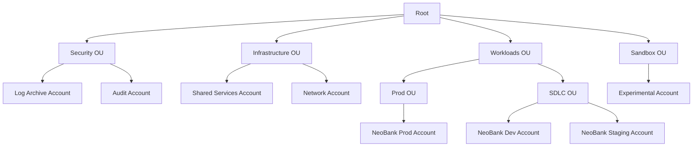
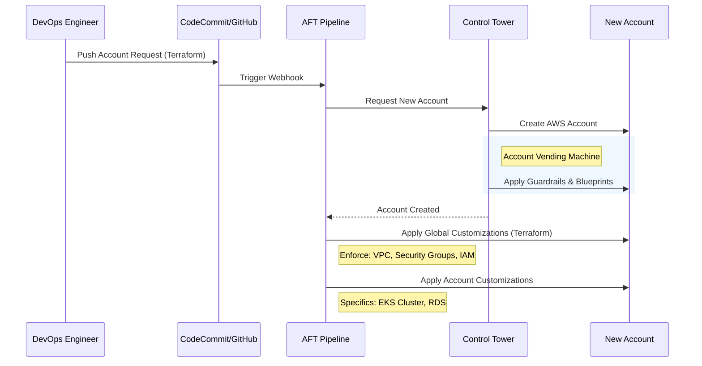
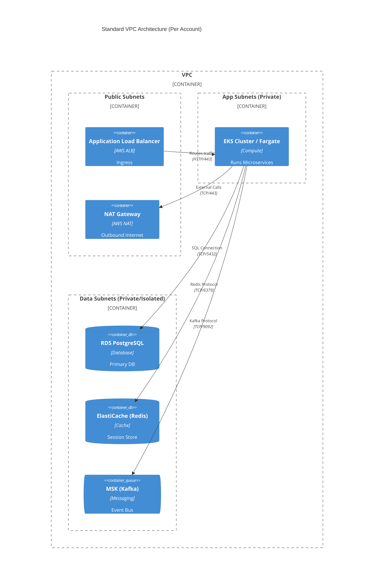

# AWS Infrastructure & Landing Zone

This document details the "Landing Zone" architecture on AWS, which provides the foundational governance, security, and networking for the NeoBank system.

## Strategy: Control Tower + AFT
The architecture follows the **AWS Control Tower** pattern, automated via **Account Factory for Terraform (AFT)**. This ensures all accounts are provisioned with a consistent baseline (Security Groups, IAM roles, Logging).

## Organization Structure
We use AWS Organizations to group accounts into Organizational Units (OUs) for policy management (SCPs).

## Account Strategy

| Account | Purpose |
|---------|---------|
| **Management** | Billing, SSO/Identity Center root, Control Tower Dashboard. |
| **Log Archive** | Centralized S3 bucket for CloudTrail & Config logs (Immutable). |
| **Audit** | Security monitoring, Cross-account automated audits. |
| **Shared Services**| CI/CD Runners, Docker Registry (ECR), Tooling. |
| **Network** | (Optional) Transit Gateway, VPN/Direct Connect termination. |
| **Workloads** | Where the actual `NeoBank` application runs (EKS/ECS/EC2). |

## Infrastructure Automation (AFT)
Infrastructure is not managed manually. We use **AFT (Account Factory for Terraform)**.

## Networking Architecture (Per Account)
Each Workload Account (Dev, Prod) has a standard 3-tier VPC.

