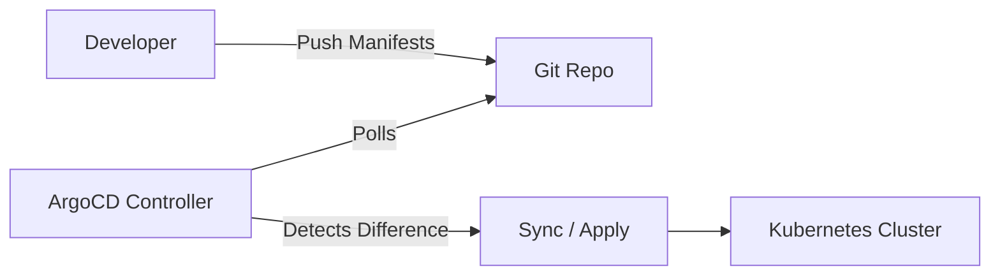
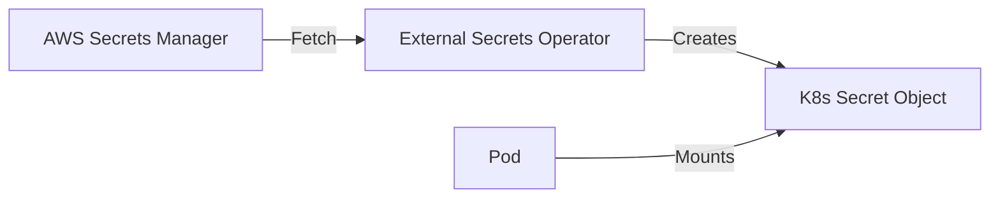
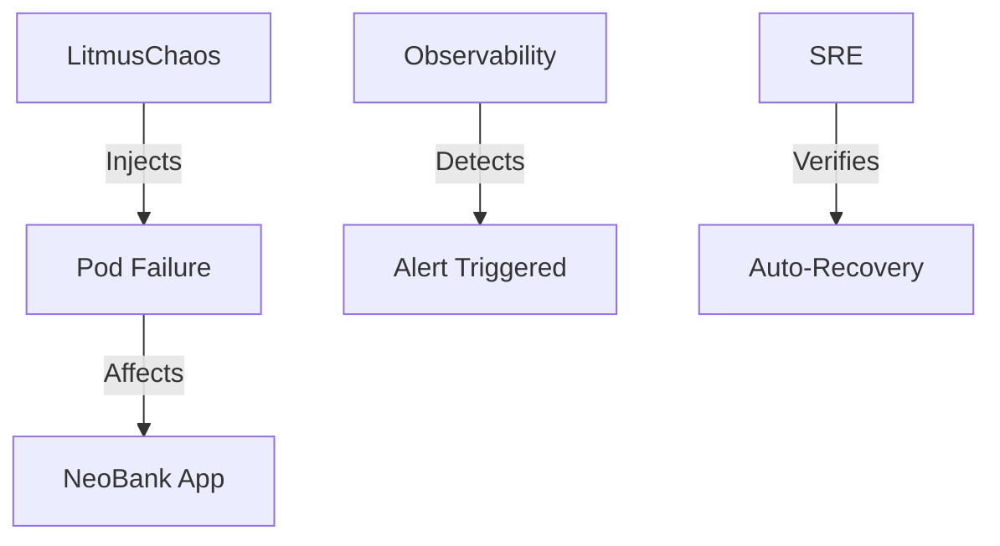

# DevOps & Reliability Architecture

This document details the operational best practices implemented in the NeoBank platform, covering GitOps, Secret Management, and Reliability Engineering.

## 1. GitOps (ArgoCD)
**Implementation**: `devops/argocd`
**Pattern**: App-of-Apps

The state of the Kubernetes cluster is synchronized with this Git repository using **ArgoCD**.
*   **Source of Truth**: The `k8s/` directory in this repo.
*   **Mechanism**: ArgoCD watches Git and automatically syncs changes to the cluster.
*   **Drift Detection**: ArgoCD detects manual changes in the cluster and reverts them (Self-Healing).

## 2. Secret Management (External Secrets)
**Implementation**: `k8s/base/external-secrets.yaml`
**Tool**: External Secrets Operator (ESO)

We **DO NOT** store actual secrets in Git. We utilize the **External Secrets Operator** to sync secrets from AWS Secrets Manager into Kubernetes `Secrets`.

1.  **AWS Secrets Manager**: Stores `DB_PASSWORD`, `API_KEYS` (Encrypted).
2.  **ExternalSecret CRD**: Defines which keys to fetch.
3.  **Operator**: Fetches value and creates a native `Kind: Secret`.

## 3. Reliability & Chaos Engineering
**Implementation**: `chaos/litmus`
**Tool**: LitmusChaos

We proactively test resilience by injecting failures.
*   **Experiments**: Defined in `chaos/litmus/experiments.yaml`.
*   **Scenarios**:
    *   Pod Delete (Randomly kill Payment Service).
    *   Node Drain (Simulate worker node failure).
    *   Network Latency (Inject delay between services).

## 4. Gap Analysis & Roadmap (Missing Best Practices)

While the platform is robust, the following "Day 2" operational capabilities are currently **missing** and recommended for the next phase.

### FinOps / Cost Management
*   **Current State**: No visibility into cost per-tenant or per-service.
*   **Recommendation**: Implement **Kubecost**.
*   **Value**: Analyze spend by Namespace/Label to chargeback costs to specific features.

### Disaster Recovery (DR)
*   **Current State**: RPO/RTO is undefined for cluster disasters.
*   **Recommendation**: Implement **Velero**.
*   **Value**: Automated backups of Kubernetes Manifests + Persistent Volumes to S3, allowing full cluster restoration in a new region.
