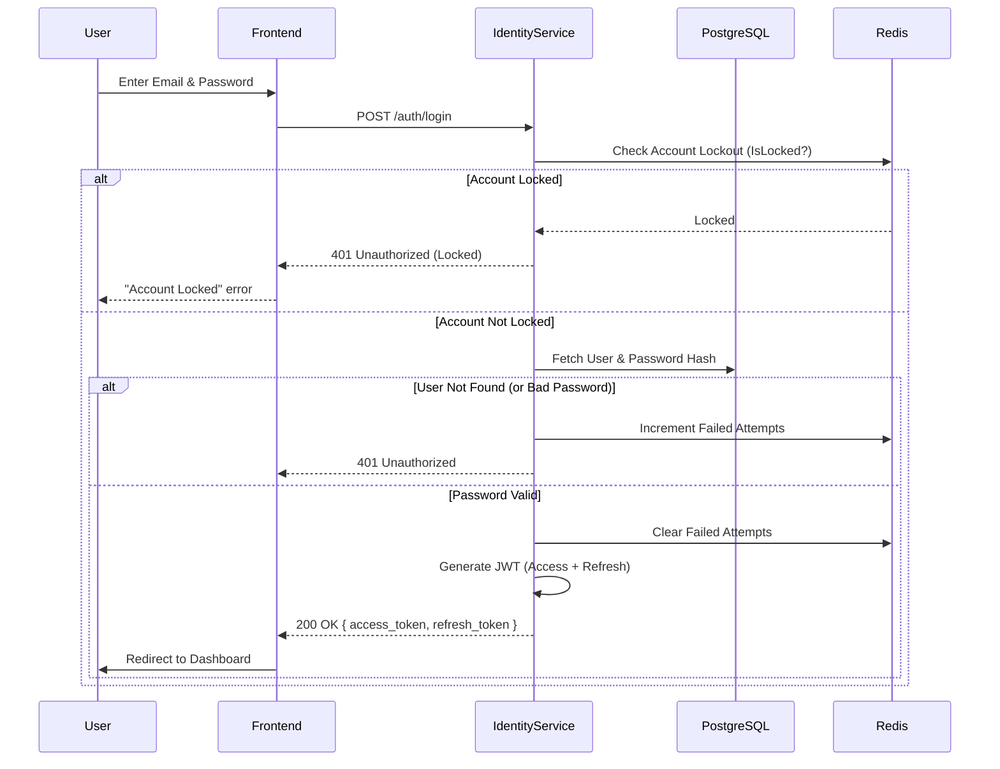

# Identity & Authentication Architecture

This document details the authentication and identity management flows within NeoBank.

## Overview
The **Identity Service** is responsible for:
*   User Registration (KYC)
*   Authentication (Login with Email/Password)
*   Token Management (JWT Access & Refresh Tokens)
*   Security Controls (Account Lockout, Rate Limiting)

## Login Flow
The detailed flow for a user logging in.

## Security Mechanisms
1.  **Bcrypt**: Passwords are hashed using `bcrypt` (Cost 12).
2.  **JWT**:
    *   **Access Token**: Short-lived (15 mins). Contains `sub` (user_id), `role`.
    *   **Refresh Token**: Long-lived (7 days).
3.  **Account Lockout**:
    *   Implemented via `AccountLockout` (In-Memory/Redis).
    *   After `N` failed attempts, account is locked for `T` duration.
