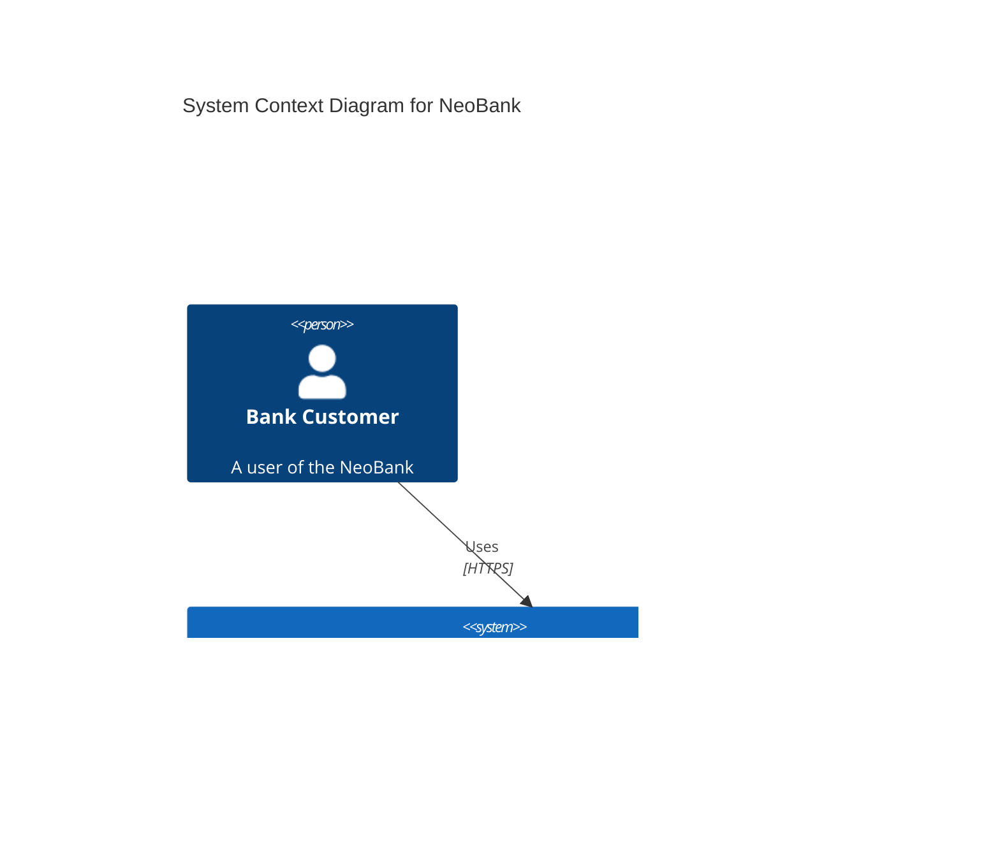

# NeoBank Architecture Overview

This document provides a high-level overview of the NeoBank system architecture. It is designed to help understanding of the system's context, containers, and core relationships.

## System Context Diagram

The user interacts with the **NeoBank Web App**. The app communicates with the backend services via HTTP/REST.



## Container Diagram

The system is composed of several microservices, a frontend, and infrastructure components.

### Core Services
1.  **Identity Service**: Handles Authentication and User Management.
2.  **Ledger Service**: Manages Accounts and Historical Balances.
3.  **Payment Service**: Orchestrates money transfers.
4.  **Product Service**: Catalog of banking products.
5.  **Card Service**: Manages debit/credit cards.

### Infrastructure
*   **PostgreSQL**: Primary transactional database (Schema: `newbank_core`).
*   **Redis**: Caching and session storage.
*   **Kafka**: Asynchronous event messaging (e.g., Transfer events).

```mermaid
C4Container
    title Container Diagram for NeoBank Microservices

    Person(user, "Customer", "Uses the banking app")

    Container(frontend, "Frontend Web App", "Next.js, React", "Provides the UI for the bank")
    
    System_Boundary(backend, "Backend Services") {
        Container(identity, "Identity Service", "Go", "Auth, User Management")
        Container(ledger, "Ledger Service", "Go", "Accounts, Balance, History")
        Container(payment, "Payment Service", "Go", "Transfer Orchestration")
        Container(product, "Product Service", "Go", "Product Catalog")
        Container(card, "Card Service", "Go", "Card Issuance & Management")
    }

    System_Boundary(infra, "Infrastructure") {
        ContainerDb(db, "PostgreSQL", "Relational DB", "Core Banking Data")
        ContainerDb(redis, "Redis", "Key-Value Store", "Caching, Session Lockout, Rate Limiting")
        ContainerQueue(kafka, "Kafka", "Event Bus", "Async messaging for transfers")
    }

    Rel(user, frontend, "Uses", "HTTPS")

    Rel(frontend, identity, "Logins / Auth", "JSON/HTTP")
    Rel(frontend, ledger, "View Accounts/Balance", "JSON/HTTP")
    Rel(frontend, payment, "Initiate Transfer", "JSON/HTTP")
    Rel(frontend, product, "Browse Products", "JSON/HTTP")
    Rel(frontend, card, "Manage Cards", "JSON/HTTP")

    Rel(identity, db, "Reads/Writes Users", "SQL")
    Rel(identity, redis, "Stores Lockouts", "Redis Protocol")

    Rel(ledger, db, "Reads/Writes Balances", "SQL")
    Rel(ledger, redis, "Caches Account Lists", "Redis Protocol")

    Rel(payment, db, "Records Payments", "SQL")
    Rel(payment, ledger, "Updates Balance (Sync/Async)", "HTTP/Event")
    Rel(payment, kafka, "Publishes Transfer Events", "Kafka Protocol")

    Rel(product, db, "Reads Products", "SQL")
    Rel(card, db, "Reads/Writes Cards", "SQL")

## Deployment & Infrastructure View

The NeoBank system is deployed onto a secure **AWS Landing Zone**.

```mermaid
graph TB
    subgraph AWS[AWS Cloud]
        subgraph Org[AWS Organization]
            
            subgraph Sec[Security OU]
                Log[Log Archive Account]
                Audit[Audit Account]
            end
            
            subgraph Work[Workloads OU]
                subgraph Prod[Prod Account]
                    subgraph VPC[VPC]
                        EKS[EKS Cluster]
                        RDS[RDS Database]
                    end
                end
            end
        end
    end

    EKS -->|Runs| neobank[NeoBank Services]
    neobank -->|Persists| RDS
    
    Log -->|Collects Logs| neobank
    Audit -->|Monitors| AWS
```

For detailed infrastructure specifics (Accounts, AFT, VPCs), see [AWS Infrastructure](./aws_infra.md).
```
