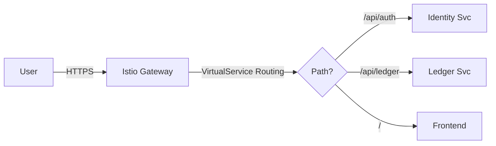
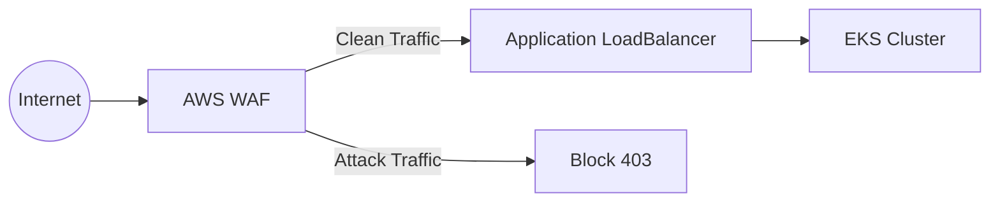
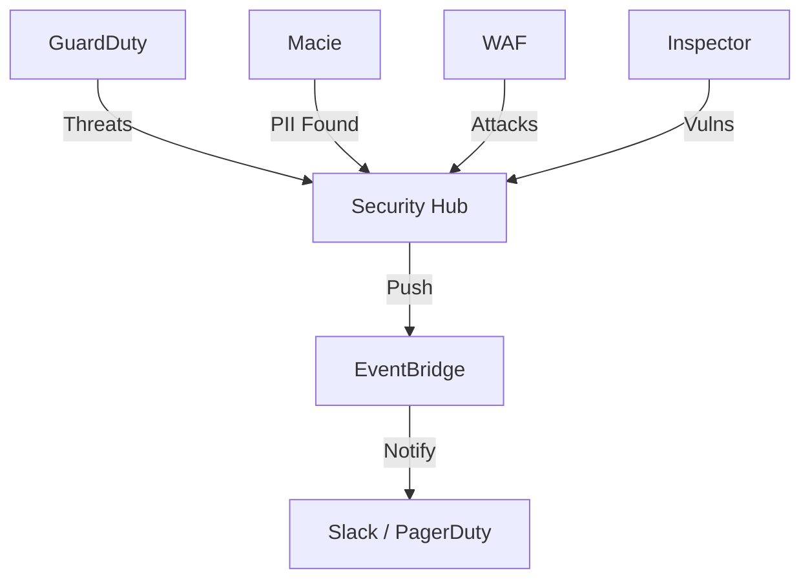

# Security & Networking Architecture

This document answers how Service Mesh, Discovery, and Cloud Security tools (WAF, Macie, GuardDuty) are implemented in the NeoBank architecture.

## Kubernetes Networking & Service Mesh (Istio)

Service-to-service communication is managed by **Istio Service Mesh**.

### 1. Traffic Management (Ingress Gateway)
External traffic enters via the `istio-ingressgateway` and is routed by VirtualServices.
*   **Manifest**: `k8s/istio/gateway.yaml`
*   **Base URL**: `neobank.com`
*   **Routes**:
    *   `/api/auth` -> `neobank-identity-service`
    *   `/api/payment` -> `neobank-payment-service`
    *   `/api/ledger` -> `neobank-ledger-service`
    *   `/*` -> `neobank-frontend`

### 2. mTLS (PeerAuthentication)
Mutual TLS is enforced in `STRICT` mode for the `default` namespace.
*   **Manifest**: `k8s/istio/peer-authentication.yaml`
*   **Effect**: All traffic between pods is encrypted automatically. No simple HTTP allowed inside the mesh.

### Service Discovery
Istio proxies (Envoy) use the control plane (Istiod) to discover endpoints, rather than relying solely on CoreDNS VIPs for load balancing. This allows for:
*   Percentage-based rollouts (Canary)
*   Circuit Breaking
*   Retry Logic (transparent to app)

## Cloud Security Services

These components are implemented at the **AWS Platform Level**, largely automated by the Control Tower Landing Zone.

### 1. WAF (Web Application Firewall)
**Implementation**: `infra/terraform/modules/waf`
**Placement**: Attached to the **Application Load Balancer (ALB)** ingress controller.

*   **Protects Against**: SQL Injection, XSS, Bad Bots.
*   **Managed Rules**: Uses `AWSManagedRulesCommonRuleSet` and `AWSManagedRulesSQLiRuleSet`.

### 2. Amazon GuardDuty (Threat Detection)
**Implementation**: Enabled via **Control Tower** (Auditable in Security OU).
**Function**: Analyzes CloudTrail logs, VPC Flow Logs, and DNS logs for suspicious activity.

*   **Findings**: Centralized in the **Audit Account**.
*   **Examples**: "CryptoCurrency Mining", "SSH Brute Force", "API calls from Tor nodes".

### 3. Amazon Macie (Data Privacy)
**Implementation**: Scheduled discovery jobs on S3 Buckets.
**Focus**: **Sensitive Data Discovery** (PII/Financial Data).

*   **Scope**: Scans the `Data Lake` bucket and `Log Archive` buckets.
*   **Alerts**: If `Credit Card Numbers` or `Social Security Numbers` appear in unencrypted S3 buckets, an alert is sent to Security Hub.

## Security Hub Aggregation
All findings from GuardDuty, Macie, and WAF flow into **Security Hub**.

