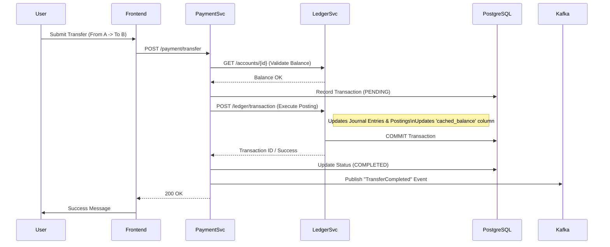

# Transaction & Information Flow

This document details how money moves within NeoBank (Internal & External transfers) and how balances are updated.

## Transfer Lifecycle
A transfer involves coordination between **Front-End**, **Payment Service**, and **Ledger Service** with **Kafka** for event propagation.

### 1. Transfer Initiation (Synchronous)
Users initiate transfers via the Dashboard.



### 2. Balance Update & Caching (The "Fix")
When `Ledger Service` posts a transaction, it MUST ensure the read-models (Dashboard) are consistent.

```mermaid
flowchart TD
    A[PostTransaction Request] --> B{Validate Accounts};
    B -- Valid --> C[Create Journal Entry];
    C --> D[Create Postings (Debit/Credit)];
    D --> E[Update SQL 'cached_balance'];
    E --> F[Invalidate Redis Cache];
    
    subgraph CacheInvalidation
    F --> G[Delete 'balance:{accountID}'];
    F --> H[Delete 'account:{accountID}'];
    F --> I[Delete 'accounts:list:{userID}'];
    end
    
    I --> J[Return Success];
    
    note[Note: Step I is critical for Dashboard updates];
```

## Data Models
*   **Journal Entry**: Represents the "Event" of a transaction (Date, Description, Ref).
*   **Posting**: Represents the specific movement of money for a single account (AccountID, Amount, Direction).
    *   *Double Entry*: Every Journal Entry has at least 2 postings (Sum = 0).
