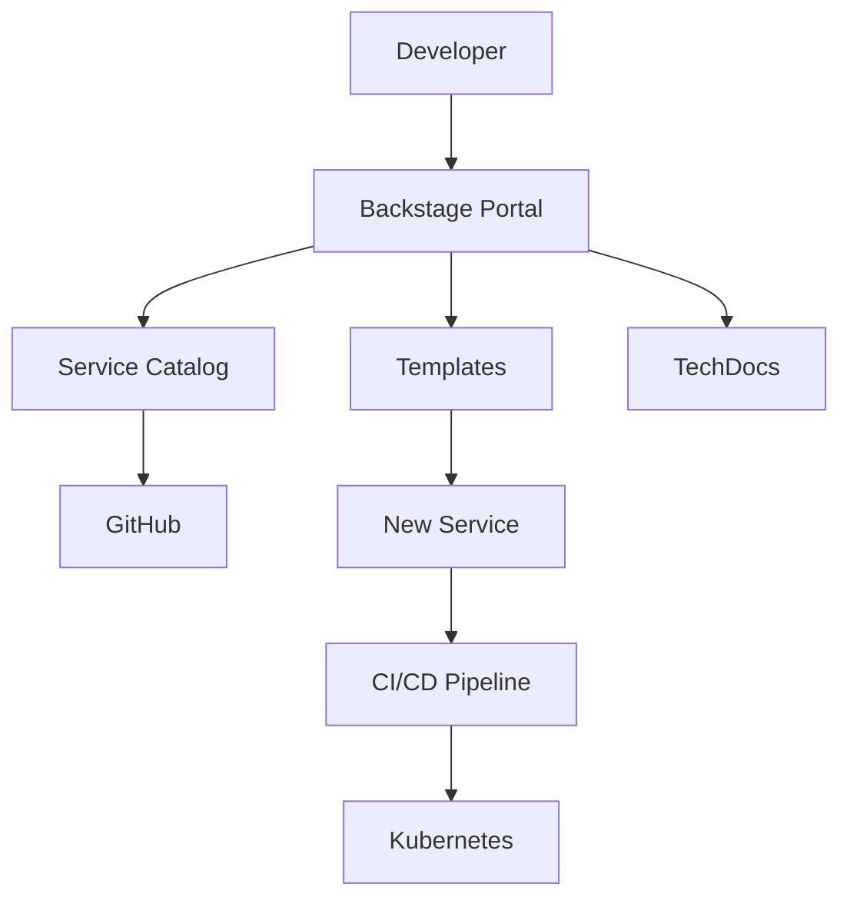

# NeoBank Internal Developer Platform

This directory contains configurations for the NeoBank Internal Developer Platform (IDP).

## Overview

The IDP provides self-service capabilities for developers, enabling them to:

- 🚀 Create new services from templates
- 📚 Discover existing services and APIs
- 🔍 View service dependencies
- 📊 Access observability dashboards
- 🔐 Manage secrets and configurations

## Components

### Backstage

[Backstage](https://backstage.io) is our developer portal.

```
backstage/
├── catalog-info.yaml    # Root catalog
├── services/            # Service definitions
└── templates/           # Service templates
```

### Golden Paths

Opinionated, supported paths for building services.

```
golden-paths/
└── README.md           # Documentation
```

## Setup

### Running Backstage Locally

```bash
# Install Backstage CLI
npm install -g @backstage/cli

# Create app (first time only)
npx @backstage/create-app

# Start development server
cd my-backstage-app
yarn dev
```

### Registering the Catalog

1. Go to Backstage UI
2. Click "Register Existing Component"
3. Paste: `https://github.com/Femi-lawal/neobank/blob/main/platform/backstage/catalog-info.yaml`

## Service Catalog

| Service | Type | Owner |
|---------|------|-------|
| identity-service | Backend | platform-team |
| ledger-service | Backend | platform-team |
| payment-service | Backend | platform-team |
| product-service | Backend | platform-team |
| card-service | Backend | platform-team |
| neobank-frontend | Website | platform-team |

## Creating a New Service

1. Go to Backstage → Create
2. Select "NeoBank Go Microservice"
3. Fill in the form:
   - Service name
   - Description
   - Owner team
   - Port number
4. Click "Create"
5. New repo with golden path template is created

## Architecture



## Resources

- [Backstage Documentation](https://backstage.io/docs)
- [Golden Paths Guide](./golden-paths/README.md)
- [Service Templates](./backstage/templates/)
